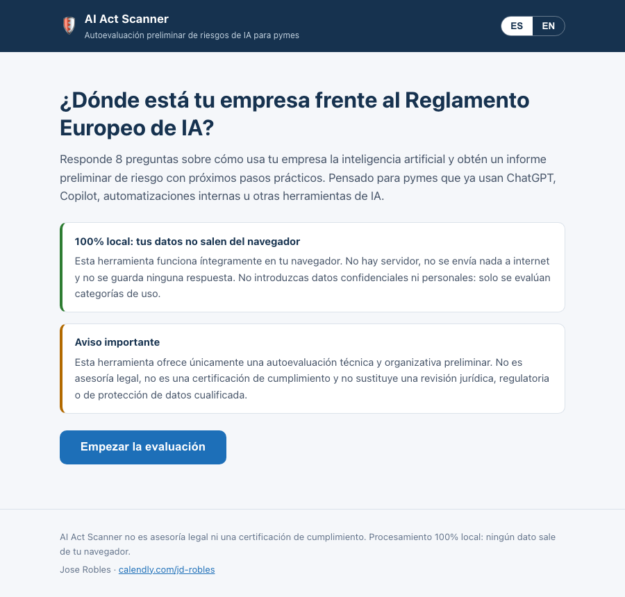

# AI Act Scanner

A printable internal self-assessment tool for Spanish SME teams to structure a first AI usage risk conversation under the EU AI Act.

**Live demo: <https://josediegorobles.github.io/ai-act-scanner/>**



## How It Works

AI Act Scanner is a static single-page web app — vanilla HTML, CSS and JavaScript, with no backend, no build step and no frameworks. It is 100% local-first: every answer is processed in the browser and no data ever leaves it.

1. **Wizard questionnaire** — 8 steps covering sector, company size, AI tools in use, personal/sensitive data, use of AI in HR, healthcare, finance, education, credit scoring or automated decision-making, internal guidelines, and human review of AI outputs.
2. **Scoring engine** — [`js/scoring.js`](js/scoring.js) is a small pure-function rule interpreter. All rules are explicit data in [`data/rules.json`](data/rules.json), grouped into four areas loosely mapped to the EU AI Act: personal & sensitive data, Annex III high-risk uses, internal governance, and human oversight. Each area and the overall result resolve to **low / medium / high / unknown**.
3. **Checklist report** — on-screen summary plus a downloadable PDF (generated locally with jsPDF from a CDN): overall risk level, risk per area, main risks identified, and practical next steps for an internal team review.
4. **Bilingual** — Spanish (default) and English, switchable at any time; all strings live in [`js/i18n.js`](js/i18n.js).

### Regulatory framing

Regulatory calendar assertions live in [`data/regulatory-status.json`](data/regulatory-status.json), not in prose-only copy. The UI renders the report context from that file, and this README block can be regenerated with:

```bash
node scripts/render-regulatory-readme.js --write
```

<!-- regulatory-status:start -->
### Regulatory status

Source of truth: [`data/regulatory-status.json`](data/regulatory-status.json).

Last reviewed: **2026-07-02**.

- Digital Omnibus status: `provisional_agreement` (7 May 2026).
- Annex III stand-alone high-risk AI systems: **2 December 2027**.
- High-risk AI systems embedded in products under EU harmonisation legislation: **2 August 2028**.

CI fails when `last_reviewed` is older than 6 months, so this block is a reminder to re-check the official sources before relying on the calendar.
<!-- regulatory-status:end -->

### Running locally

Serve the folder with any static server (the rules JSON is loaded with `fetch`, so `file://` won't work):

```bash
python3 -m http.server 8000
# open http://localhost:8000
```

### Tests

The scoring engine is the one piece that must not fail, so it is unit-tested in plain Node (no dependencies):

```bash
node test/scoring.test.js
```

The same test command also checks that regulatory status data was reviewed within the last six months and that the README regulatory block still matches [`data/regulatory-status.json`](data/regulatory-status.json).

### jsPDF SRI

The PDF export loads jsPDF from cdnjs with Subresource Integrity (SRI). If you change the jsPDF version or CDN URL in [`index.html`](index.html), regenerate the `sha384` value against the exact CDN file:

```bash
curl -fsSL https://cdnjs.cloudflare.com/ajax/libs/jspdf/2.5.1/jspdf.umd.min.js \
  | openssl dgst -sha384 -binary \
  | openssl base64 -A
```

Then update the `integrity="sha384-..."` attribute and keep `crossorigin="anonymous"` on the script tag.

### Deployment

Deployed with GitHub Pages from the `main` branch (root folder). Everything is static, so any static host works.

## Who It Is For

AI Act Scanner is designed for small and medium-sized companies in Spain that are already using, testing, or planning to adopt AI tools in day-to-day operations and want a printable internal checklist.

Typical users include SMEs using tools such as ChatGPT, Microsoft Copilot, Gemini, internal AI automations, AI assistants, HR software, document processing workflows, customer support automation, or other AI-enabled business systems.

The project is especially relevant for founders, operations teams, engineering leaders, HR managers, customer support managers, and business owners who need a practical first view of where AI-related risk may exist before an internal discussion or a deeper legal, compliance, or technical review.

## What Problem It Solves

Many SMEs are adopting AI faster than they are documenting policies, reviewing risks, or clarifying responsibilities. This creates uncertainty around:

- whether AI tools are being used in sensitive business areas
- whether personal or sensitive data is being processed
- whether employees have clear AI usage guidelines
- whether AI outputs are reviewed by humans
- whether specific use cases may require expert legal or compliance review

AI Act Scanner helps companies structure this first internal conversation. It does not certify compliance and does not provide legal advice. Its purpose is to make AI usage more visible, easier to discuss, easier to print, and easier to prioritize.

## What The MVP Will Do

The MVP will provide a simple questionnaire and generate a preliminary risk summary based on the answers provided.

It will help users:

- describe how AI is currently used inside the company
- identify whether AI is used in higher-risk contexts
- flag potential exposure related to personal data, sensitive data, automated decisions, or regulated sectors
- receive a basic low, medium, high, or unknown risk indication
- receive practical next steps for an internal checklist review
- understand when to seek expert review

## Example Questionnaire

The first version of the questionnaire may ask for:

- sector
- company size
- AI tools used
- whether personal data is processed
- whether sensitive data is processed
- whether AI is used in HR, education, healthcare, finance, law enforcement, credit scoring, or automated decision-making
- whether employees receive AI usage guidelines
- whether AI outputs are reviewed by humans

## Example Output

An example preliminary report may include:

- risk level: low, medium, high, or unknown
- main risks identified
- recommended next steps
- a clear note on when expert review may be needed

The output should be understandable by non-lawyers and useful enough to support an internal conversation between business, technical, and compliance stakeholders.

## Privacy Principles

AI Act Scanner should follow conservative privacy principles from the beginning:

- do not upload confidential data
- do not upload personal data
- prefer local-first processing where possible
- collect only the information needed for the self-assessment
- make limitations clear before users enter information

The intended use is to assess categories of AI usage, not to analyze private documents, customer records, employee records, prompts, contracts, or production data.

## Disclaimer

AI Act Scanner provides a preliminary technical and organizational risk self-assessment only.

It is not legal advice. It is not a compliance certification tool. It is not a substitute for qualified legal, regulatory, compliance, or data protection review.

Companies using AI in sensitive, regulated, or high-impact areas should seek expert review before relying on internal AI processes or deploying AI-enabled workflows.

## Relationship With AI Act Diagnosis Bot

This repository is intentionally positioned as an internal, printable checklist tool for teams that want to discuss AI usage risks without submitting data anywhere.

For a more guided lead-magnet experience, use AI Act Diagnosis Bot instead: <https://github.com/josediegorobles/ai-act-diagnosis-bot>.

## Roadmap

- [x] web form
- [x] PDF report
- [x] Spanish and English support
- [ ] sector-specific templates
- [ ] internal AI policy generator

## Author

Jose Robles — Head of Engineering / AI Architect

Rust + AI + Web3 + technical leadership

